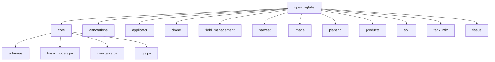

# AgDMALabs-open

## Folder Structure and Schema

```mermaid
graph TD
    A[open_aglabs] --> B[core];
    A --> C[annotations];
    A --> D[applicator];
    A --> E[drone];
    A --> F[field_management];
    A --> G[harvest];
    A --> H[image];
    A --> I[planting];
    A --> J[products];
    A --> K[soil];
    A --> L[tank_mix];
    A --> M[tissue];

    B --> B1[schemas];
    B --> B2[base_models.py];
    B --> B3[constants.py];
    B --> B4[gis.py];
```
